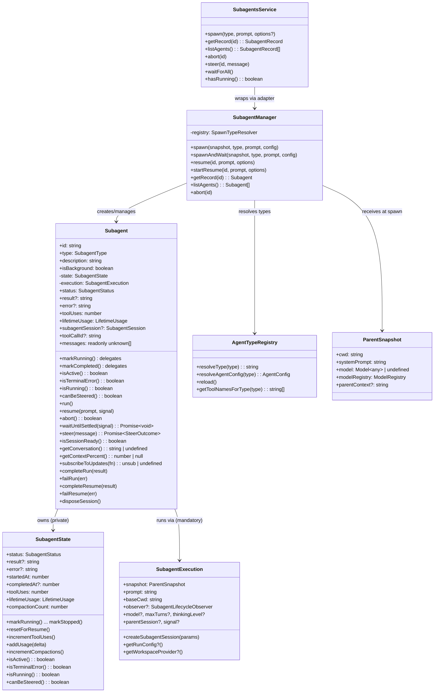
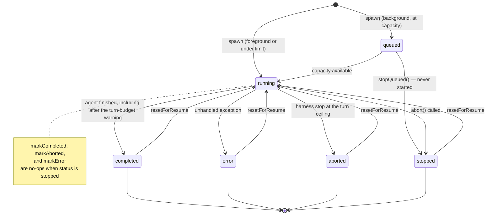
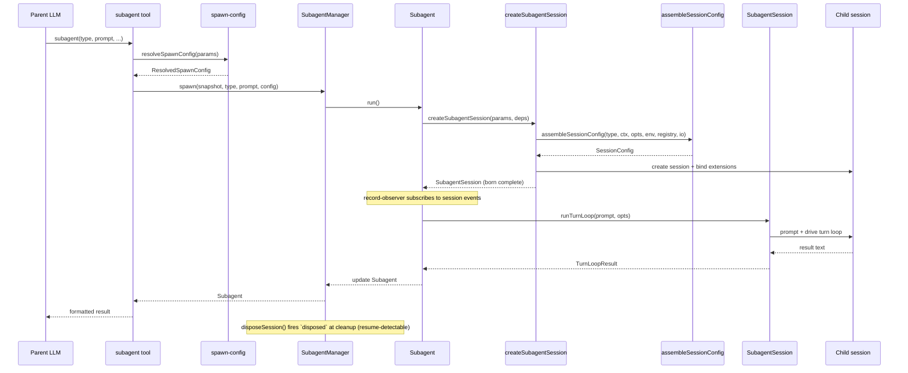
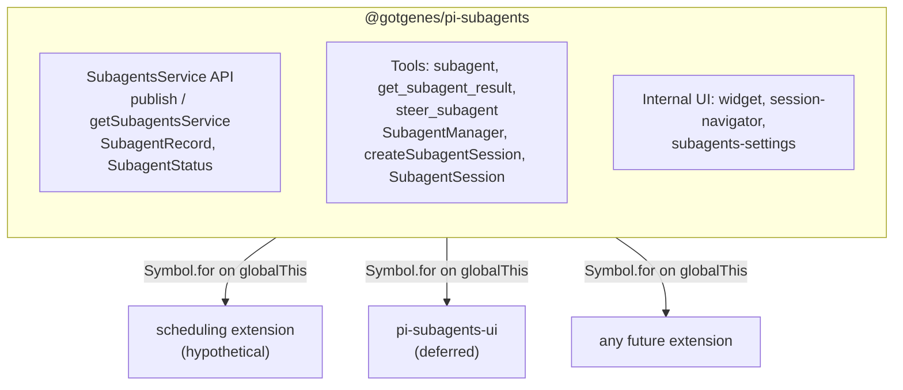

# Architecture

This document describes the architecture of the pi-subagents fork: a focused, composable core with a stable API boundary that other extensions can build on.

## Design principles

1. **Narrow core** — the extension owns agent spawning, execution, and result retrieval.
   Everything else is a consumer.
2. **Composable by default** — other extensions can spawn agents, observe their lifecycle, and display their state without importing this package directly.
3. **Typed API boundary** — this package exports a `SubagentsService` interface and `Symbol.for()` accessors (`publishSubagentsService` / `getSubagentsService`).
   Consumers declare this package as an optional peer dependency and use dynamic import for compile-time types.
   The runtime bridge is `Symbol.for("@gotgenes/pi-subagents:service")` on `globalThis` — no separate API package.
4. **No time-based scheduling** — cron-style timed dispatch (upstream's `schedule.ts` subsystem) is removed from the core (#52).
   Timed dispatch is a separate concern that any extension can implement by calling `spawn()` on the published API.
   The max-concurrent admission gate is not scheduling in this sense — concurrency management stays in core.
5. **UI is an in-core, substitutable consumer** — [ADR-0004](../decisions/0004-reconsider-ui-direction.md) records the per-component decision: the widget shrinks to background agents only, the bespoke conversation viewer is replaced by native session navigation, the `/agents` command is dissolved into focused surfaces, and the surviving UI stays in the core as a reactive consumer (not extracted to a separate package).
   Extraction remains an available future option because the composition invariant holds — the core is byte-for-byte identical with or without a given UI consumer.
6. **Snapshot, don't capture** — mutable parent state (ctx, session, model) is read once at spawn time and frozen into a `ParentSnapshot` data object.
   No live references survive past the spawn call.
7. **Subscribe, don't thread** — observation of agent progress uses direct session-event subscription, not callback parameters threaded through multiple layers.
8. **Construct complete** — objects are born with all their dependencies.
   If state isn't available yet, the object that needs it doesn't exist yet.
   No post-construction field writes from external code — if an object can't be instantiated ready-to-go, the prep work hasn't been done and the right dependencies haven't been identified.
9. **State owns its mutations** — mutable state lives in a class whose methods enforce valid transitions and invariants.
   Free functions that mutate module-scoped variables, closure-captured bags-of-functions, and external writes to shared interfaces are replaced by classes that encapsulate the state they manage.
10. **Open for extension, closed for modification** — pi-subagents is a minimal core that publishes events and a service API.
    Other packages (pi-permission-system, a future UI extension, hypothetical OTel integration) hook into these events to add permissions, rendering, or telemetry.
    Pi-subagents has zero knowledge of its consumers — dependency arrows point inward, never outward.

## Scope and non-goals

The README carries a short charter for the boundaries that come up most often.
This is the full inventory, with the decision record or design principle each rests on.

| Non-goal                                                                      | Rests on                                                                                             |
| ----------------------------------------------------------------------------- | ---------------------------------------------------------------------------------------------------- |
| Time-based scheduling (cron / interval / one-shot dispatch)                   | Design principle 4; `history/phase-2-remove-scheduling.md`                                           |
| Ad-hoc cross-extension event RPC (`subagents:rpc:*`)                          | Design principle 3; §"What the core dropped"                                                         |
| Group-join / consolidated completion notifications                            | §"What the core dropped"; `history/phase-3-remove-rpc-groupjoin.md`                                  |
| Model-scope enforcement (an `enabledModels` allowlist in the core)            | `docs/comparison-with-upstream.md` only — the weakest entry here                                     |
| Per-agent tool restriction policy (`disallowed_tools`, a built-in denylist)   | [ADR-0002](../decisions/0002-extensions-on-a-minimal-core.md); §"Child tool selection"               |
| Widening a child's tool allowlist with capability tools on the agent's behalf | §"Child tool selection"; operator position on the additive-key case                                  |
| A global run-mode default                                                     | Operator position; per-agent `run_in_background` already exists                                      |
| Worktree / environment isolation in the core                                  | [ADR-0002](../decisions/0002-extensions-on-a-minimal-core.md) §"What leaves the core"                |
| Persistent agent memory (`memory:`) and skill preloading (`skills:`)          | [ADR-0002](../decisions/0002-extensions-on-a-minimal-core.md); comparison doc                        |
| Per-agent extension lifecycle control (`isolated`, `extensions:`, `noSkills`) | [ADR-0002](../decisions/0002-extensions-on-a-minimal-core.md) and its amendment                      |
| New generative provider seams without a concrete consumer                     | [ADR-0002](../decisions/0002-extensions-on-a-minimal-core.md) §"The governing rule: no vacant hooks" |
| In-viewer steering or interactive child-session takeover                      | [ADR-0004](../decisions/0004-reconsider-ui-direction.md) Addendum criteria 1 and 2                   |
| Bespoke transcript rendering in the core                                      | [ADR-0004](../decisions/0004-reconsider-ui-direction.md) Decision B                                  |
| Agent-definition authoring UI (wizard, config editor, `/agents` menu)         | [ADR-0004](../decisions/0004-reconsider-ui-direction.md) Decision C                                  |
| Duplicating foreground progress in the above-editor widget                    | [ADR-0004](../decisions/0004-reconsider-ui-direction.md) Decision A                                  |
| Propagating the parent's `pi -e <path>` ephemeral extensions to children      | [ADR-0001](../decisions/0001-deferred-patches.md), now superseded — restate before citing            |

Extracting the surviving UI to a separate package is a **not now with criteria**, not a decline: [ADR-0004](../decisions/0004-reconsider-ui-direction.md) Decision D names the revisit conditions.

The following are **not** boundaries.
Pi's client-server split is a deferral pending an upstream capability (`docs/architecture/client-server-opportunities.md`), not a declined direction.
The parity status of the SDK `spawn()` path against the tool path, the stability guarantee carried by the lifecycle event payloads, parent-data redaction for SDK-spawned children, and ownership of `get_subagent_result` presentation are all unstated rather than settled.
`SubagentRecord`'s own guarantee is no longer among them: [decision 0005](../decisions/0005-subagent-record-admission-policy.md) settles what the public snapshot admits and which direction the contract runs.

The reimplement-don't-merge contribution pattern, applied across eight closed pull requests, is a repo-wide process rather than a scope boundary, and is documented in the repository's [contributing guide](https://github.com/gotgenes/pi-packages/blob/main/CONTRIBUTING.md).

## Domain model

The extension is organized around six domains, each responsible for one aspect of managing agents.

```mermaid
flowchart TB
    subgraph config["Config domain"]
        direction TB
        AgentTypeRegistry["AgentTypeRegistry<br/>(registry of agent types)"]
        DefaultAgents["default-agents<br/>(built-in types)"]
        CustomAgents["custom-agents<br/>(user .md files)"]
        InvocationConfig["invocation-config<br/>(per-call merge)"]
        ThinkingLevelModule["thinking-level<br/>(level vocabulary)"]
    end

    subgraph session["Session domain"]
        direction TB
        SessionConfig["assembleSessionConfig<br/>(pure assembler)"]
        Prompts["prompts<br/>(system prompt)"]
        Context["context<br/>(parent history)"]
        Env["env<br/>(git/platform)"]
        ModelResolver["model-resolver<br/>(fuzzy match)"]
        ProviderInheritance["provider-inheritance<br/>(replay parent providers)"]
    end

    subgraph lifecycle["Lifecycle domain"]
        direction TB
        SubagentManager["SubagentManager<br/>(spawn, abort, collection)"]
        ConcurrencyLimiter["ConcurrencyLimiter<br/>(thunk admission gate)"]
        CreateSubagentSession["createSubagentSession<br/>(assembly factory)"]
        SubagentSession["SubagentSession<br/>(turn loop, steer, dispose)"]
        Subagent["Subagent<br/>(status, behavior: abort/steer/run lifecycle)"]
        ParentSnapshot["ParentSnapshot<br/>(frozen parent state)"]
        Workspace["workspace<br/>(provider seam: child cwd + teardown)"]
    end

    subgraph observation["Observation domain"]
        direction TB
        RecordObserver["record-observer<br/>(stats + live activity via events)"]
        Notification["notification<br/>(completion nudges)"]
    end

    subgraph tools["Tools domain"]
        direction TB
        AgentTool["subagent tool<br/>(dispatch)"]
        ResultRenderer["result-renderer<br/>(pure rendering)"]
        SpawnConfig["spawn-config<br/>(resolve params)"]
        FgRunner["foreground-runner"]
        BgSpawner["background-spawner"]
        GetResult["get_subagent_result"]
        GetResultRenderer["get-result-renderer<br/>(pure rendering)"]
        Steer["steer_subagent"]
    end

    subgraph ui["UI domain"]
        direction TB
        Widget["agent-widget<br/>(live status)"]
        Sessions["session-navigator<br/>(session view)"]
        Settings["subagents-settings<br/>(settings command)"]
    end

    AgentTool --> SubagentManager
    SubagentManager --> Subagent
    Subagent --> CreateSubagentSession & SubagentSession
    CreateSubagentSession --> SubagentSession
    CreateSubagentSession --> SessionConfig
    SessionConfig --> AgentTypeRegistry
    SessionConfig --> Prompts & Env
    AgentTypeRegistry --> DefaultAgents & CustomAgents
    SpawnConfig --> InvocationConfig & ThinkingLevelModule
    CustomAgents --> ThinkingLevelModule
    RecordObserver -.->|subscribes| SubagentSession
    Widget -.->|polls| SubagentManager
    SubagentManager -.->|notifies| Widget
```



### Key domain types



## Agent lifecycle



A steer (`steer_subagent`, `SubagentsService.steer()`) redirects a running agent and changes no status.
The turn budget is not a status either: it is the live `turnBudget` (`{ used, maxTurns, phase }`) the turn loop reports to the record before the first turn and after each turn boundary.
A `TurnBudgetTracker` (`turn-limits.ts`) counts successful turns and decides when `SubagentSession` warns the child (a context-only custom message once `wrapUpTurns` turns remain, which forces no turn) and when it stops the run (after a ceiling turn that ran tools, or as a turn starts past the ceiling).
`phase` is `warned` once the warning went out and `exhausted` when the harness stopped the run: the one case `completeRun` and `completeResume` end `aborted`.
A resume runs a fresh tracker under the initial run's limits.

Note: `markStopped` always succeeds regardless of current status.
Other terminal transitions guard against overwriting `stopped` — once an agent is stopped, only `resetForResume` can return it to `running`.
`stopQueued` composes `markStopped` with a never-started marker and, like `completeRun`/`failRun`, notifies the lifecycle observer — so a queued stop publishes the same events, session entry, and nudge a running stop does.

## Execution flow



## Module organization

The extension's source files are organized into domain directories — `config/`, `session/`, `lifecycle/`, `observation/`, `service/`, `tools/`, `ui/`, and `handlers/` — plus a handful of root-level entry-point and shared modules.

Those directories are fallow boundary **zones** (`boundaries` in the repo-root `.fallowrc.json`), one zone per directory plus a `pi-subagents/core` zone for the root modules.
Each zone's `allow` list is the set of zones it imported when the zones were encoded, so the baseline reports zero violations and a **new** cross-zone edge is a finding (`boundary-violation`, severity `warn`, reported by `fallow dead-code` and `fallow audit` without failing either) and a `fallow decision-surface` `coupling-boundary` question in review.
Run `pnpm --silent fallow guard <file>` before adding a cross-directory import to see what the file's zone may import; when the new edge is intended, extend that zone's `allow` list in the same commit and say why in the commit body.

Two allowed edges are not sanctioned by anything above: `lifecycle/` imports `subscribeSubagentObserver` from `observation/` (`subagent.ts`), and `observation/` imports `display` and `glyphs` from `ui/` (`renderer.ts`).
The ratchet admits them because they predate it; this document states no ordering between those directories, so whether they should exist is a question for a later discovery round rather than a violation today.

### Current layout

```text
src/
├── index.ts                        entry point, tool registration, event wiring
├── runtime.ts                      SubagentRuntime factory (session-scoped state)
├── types.ts                        shared type definitions
├── persisted-record.ts             subagents:record session-entry contract (writer's builder, reader's parser)
├── settings.ts                     SettingsManager (persistent operational settings)
├── debug.ts                        debug logging utility
├── layered-settings.ts             loadLayeredSettings helper (published as @gotgenes/pi-subagents/settings)
│
├── config/                         agent type definitions and resolution
│   ├── agent-types.ts              AgentTypeRegistry class
│   ├── default-agents.ts           built-in agent configs (general-purpose, Explore, Plan)
│   ├── custom-agents.ts            user-defined agent .md file loader
│   ├── invocation-config.ts        per-call config merge (caller wins unless `locked`); background-mode resolution
│   └── thinking-level.ts           thinking-level vocabulary and parser, wider than pi-ai's `ThinkingLevel`
│
├── session/                        session assembly and preparation
│   ├── session-config.ts           pure assembler (main entry)
│   ├── prompts.ts                  system prompt building; inherits the parent prompt's identity, cutting the session-resolved tail (ADR 0006) and dropping Pi's `<tools>`/`<rules>` sections on the section-shaped prompt (ADR 0011) — and the project-context block too for a child running in its own directory (ADR 0010) — or its portable parts alone for a re-homing provider (ADR 0009)
│   ├── project-context.ts          Pi's `<project_context>` block, rendered in pi ≥0.86's shape; the loader a child whose adopted identity describes another directory resolves its own with (ADR 0010)
│   ├── ask-parent-tool.ts          child-facing ask_parent: records the child's question, tells it to end its turn
│   ├── builtin-extensions.ts       selects the Pi built-ins (codemode, tool-search, MCP) a child's allowlist calls for
│   ├── mcp-tool-patterns.ts        expands `mcp__…*` allowlist entries against the parent's registered tool names
│   ├── notify-parent-tool.ts       child-facing notify_parent: one-way mid-run update, capped at 2000 characters
│   ├── content-items.ts            shared message content parsing (tool-call names, assistant content)
│   ├── context.ts                  parent conversation extraction
│   ├── conversation.ts             render a session's messages as formatted text
│   ├── env.ts                      git/platform detection
│   ├── model-resolver.ts           fuzzy model name resolution
│   ├── package-exclusions.ts       child settings view that disables excluded packages' extensions
│   ├── provider-inheritance.ts     replays the parent's runtime-registered providers onto the child's own runtime, so the child inherits them without sharing the parent's mutable pool
│   └── session-dir.ts              session directory derivation
│
├── lifecycle/                      agent execution and state tracking
│   ├── subagent-manager.ts         collection manager + observer wiring + session-retention sweep (consumption-aware; an unanswered question holds the safety cap); the resume choke point, refusing from the record's own predicate and reporting a discriminated outcome, so every front door declines the same resumes; a door that returns before the resumed run ends starts one synchronously, and each resume's caller decides whether its outcome is claimed
│   ├── create-subagent-session.ts  assembly factory: MCP pattern expansion, Pi built-in selection, session creation, spawn-tool denylist, core child-tool install, binding
│   ├── subagent-session.ts         born-complete child session: turn loop, steer, shutdown-then-dispose teardown
│   ├── turn-limits.ts              turn-budget policy: TurnBudget, the TurnBudgetTracker that decides warnings and stops, normalizeMaxTurns (minimum 2)
│   ├── subagent.ts                 owns full execution lifecycle (run, resume, abort, steer, wait-until-settled); a teardown with no result text to carry its addendum records it as a notice and announces one produced after delivery; answers why a resume would be refused (resumeRefusal, including a live run), which the resume choke point and every result carrier read rather than re-deriving; reports a resume's start as well as its end; wait-until-settled reports whether the waited run settled, has not, or was replaced by a resume (carrying what it ended with)
│   ├── subagent-state.ts           lifecycle status + metrics + result-delivery value object (transitions, accumulators, classification predicates); delivery carries a revocable claim per carrier (each releases only its own handle), a one-way consumption latch, and a per-run update ledger that renders only what no announcement delivered; numbers its runs and keeps the outcome of the run the latest resume replaced
│   ├── run-listeners.ts            per-run observer-unsub and signal-detach handles
│   ├── workspace-bracket.ts        child workspace prepare/dispose lifecycle; idempotent dispose, reports a torn-down workspace
│   ├── concurrency-limiter.ts       background admission gate: schedules run thunks FIFO against the limit
│   ├── parent-snapshot.ts          immutable spawn-time parent state, including the parent's operator-authored prompt parts composed in Pi's own order
│   ├── child-lifecycle.ts          child-execution lifecycle event publisher
│   ├── child-shutdown.ts           bounded session_shutdown emit for a child being disposed
│   ├── workspace.ts                workspace provider seam (generative extension surface)
│   └── usage.ts                    token usage tracking
│
├── observation/                    progress tracking and notification
│   ├── record-observer.ts          session-event stats observer
│   ├── notification.ts             completion nudges and mid-run updates, in one arrival-ordered withheld queue (announce-only; withheld during the parent's agent run and flushed on agent_settled, each re-checking its gates at emit rather than replaying them from enqueue — a completion on claim and consumption, an update on the claim and on the child still running, since a terminated run's updates ride its outcome and this nudge is one of their carriers), plus workspace notices, which are announced straight through
│   ├── outcome-delivery.ts         shared outcome rendering every result carrier composes: one status vocabulary in two presentations, body, and the addenda tail (mid-run updates, workspace notice, ask-back affordance — which names a resume only when the record says one would be accepted, and asks the parent to wait when the child has merely not settled) in one fixed order
│   ├── renderer.ts                 notification, mid-run-update, and workspace-notice TUI components
│   ├── composite-subagent-observer.ts fans manager notifications out to multiple observers; enumerates every member, so an optional one it omits is dropped silently
│   └── subagent-events-observer.ts manager lifecycle observer (event emission + persistence + notification)
│
├── service/                        cross-extension API boundary
│   ├── service.ts                  SubagentsService interface (spawn, query, abort, steer, resume, workspace seam) + Symbol.for() accessors
│   └── service-adapter.ts          SubagentsServiceAdapter class wrapping SubagentManager; maps live records to by-value snapshots at the boundary
│
├── tools/                          LLM-facing tool implementations
│   ├── agent-tool.ts               subagent tool definition, validation, dispatch
│   ├── result-renderer.ts          pure per-status result rendering
│   ├── spawn-config.ts             pure config resolution
│   ├── foreground-runner.ts        foreground execution loop
│   ├── background-spawner.ts       background spawn setup + the launch message every background door (spawn, resume) returns
│   ├── get-result-tool.ts          get_subagent_result tool; a wait a resume superseded reports the run it waited for
│   ├── get-result-report.ts        pure get_subagent_result report formatter
│   ├── get-result-renderer.ts      pure get_subagent_result line assembly for the collapsed and expanded TUI views
│   ├── steer-tool.ts               steer_subagent tool
│   └── helpers.ts                  shared tool utilities
│
├── ui/                             user-facing presentation
│   ├── agent-widget.ts             above-editor live status widget
│   ├── widget-renderer.ts          pure rendering for widget
│   ├── display.ts                  pure formatters and shared types
│   ├── bounded-lines.ts            component spending exactly one clipped terminal row per line
│   ├── labeled-rule.ts             full-width rule with embedded labels, Pi editor-border style
│   ├── glyphs.ts                   semantic display-glyph vocabulary (monospace-coverage constraint, #669)
│   ├── subagents-settings.ts       /subagents:settings command handler
│   ├── session-navigation.ts       pure session-selection and transcript-source logic
│   ├── session-navigator.ts        /subagents:sessions command handler
│   └── transcript-content.ts       transcript rows: per-message component blocks, width-cached (settles incrementally against Pi's state-before-listeners ordering, #689)
│
└── handlers/                       event handlers
    ├── index.ts                    barrel re-export
    ├── interrupt.ts                turn_start handler — abort all subagents on parent interrupt (ESC), when policy allows
    ├── lifecycle.ts                session_start, session_before_switch, session_shutdown
    └── widget-events.ts            widget's host events — session_start (UI context), turn_start (linger aging), session_shutdown (teardown)
```

### Observation model

Record statistics (tool uses, token usage, compaction counts) and live activity (active tools, response text) are updated by `record-observer.ts`, which subscribes directly to session events.
The turn budget is the exception: the turn loop owns the count it enforces, and reports each change to the record through its `onTurnBudget` option.
All run state still lives on the `Subagent` record.

The widget reads agent state by polling the records exposed via `SubagentManager.listAgents()` every 80 ms in fullscreen mode and every 250 ms in regular mode, where a frame's cost scales with the transcript; that poll loop is driven by the manager's lifecycle notifications (the widget subscribes as a `SubagentManagerObserver` fanned out through `CompositeSubagentObserver`), not by inbound calls from the spawn tools.
It runs if and only if a subagent is running, since a finished agent's line carries a fixed duration and the queued line is a count, so animating either would ask Pi to re-render its whole component tree for a byte-identical result.
The widget's rendered height is also bounded by the terminal's row count rather than a fixed ceiling: Pi's regular-mode differential renderer clears the screen and the scrollback whenever the first changed line sits above the previous viewport top, and the widget's spinner is that line on every tick, so a widget taller than the rows beneath it turns every tick into a destructive repaint ([#864]).
The `/subagents:sessions` navigator reads messages via `Subagent.agentMessages` and subscribes to updates via `Subagent.subscribeToUpdates()` — no direct `AgentSession` reference (#277).
It also reads the parent session's `subagents:record` entries (`persisted-record.ts`), so runs the manager no longer holds, such as those from before a `/reload`, open from their transcript file.

## Cross-extension architecture



Consumers call `getSubagentsService()?.spawn(...)` at runtime.
They declare this package as an optional peer dependency and use dynamic import for compile-time types.

### What the core owns

- The three tools: `subagent` (née `Agent`), `get_subagent_result`, `steer_subagent`.
- `SubagentManager` — spawn, abort, resume, collection management, observer wiring.
- `ConcurrencyLimiter` — background admission gate: schedules run thunks FIFO against a configurable concurrency limit.
- `createSubagentSession` — assembly factory: session creation and extension binding; returns a born-complete `SubagentSession`.
- `SubagentSession` — the born-complete child session: drives the turn loop (`runTurnLoop`/`resumeTurnLoop`), steers, and disposes (firing `disposed` at true session disposal, so resume executions are registry-detected).
- `child-lifecycle` — publishes the child-execution lifecycle (`spawning`, `session-created` before `bindExtensions()`, `bound` after it resolves, `completed`, `disposed`) on `pi.events`.
  Reactive consumers subscribe: `@gotgenes/pi-permission-system` registers each child session on `session-created`, audits it for a permission node of its own on `bound`, and unregisters it on `disposed`.
  This replaced the former outbound `permission-bridge` (#261, [ADR-0002]) — the core no longer looks up a named consumer.
- `workspace` — the single generative seam (#262, [ADR-0002]): a registered `WorkspaceProvider` supplies a child's cwd plus bracketed `dispose()` at run-start.
  With no provider, children run in the parent cwd (default unchanged); the git worktree strategy lives behind this seam in `@gotgenes/pi-subagents-worktrees` (#263, the seam's first consumer).
- `session-config` — pure configuration assembler (called by `createSubagentSession`).
- `SubagentRuntime` — session-scoped state bag with methods.
- `ParentSnapshot` — immutable snapshot of parent session state, captured once at spawn time.
- `record-observer` — session-event observer that updates record statistics without callback threading.
- Agent type registry — default agents, custom `.md` file loading.
- Prompt assembly, context extraction, skills, environment.
- Worktree isolation — evicted to `@gotgenes/pi-subagents-worktrees` via the workspace provider seam in Phase 16 (#263, [ADR-0002]); `git` no longer appears in the core.
- Token usage tracking.
- Session directory derivation and persisted `SessionManager` for subagent transcripts.
- Settings persistence.
- Internal UI (widget, `/subagents:sessions` session navigator, `/subagents:settings` command) — the conversation viewer and `/agents` menu were removed in Phase 19 (Steps 5–6, [#442], [#441]) per [ADR-0004].

### Child tool selection

A child's **capability** tool set is exactly its agent type's `tools:` list, which `createSubagentSession` hands to the SDK as the session's tool allowlist.
Pi applies that allowlist _before_ it builds the session's tool registry, so an extension loaded in the child registers its tools successfully and they are then filtered out unless the agent named them.
Naming an extension tool in `tools:` is therefore the supported way to give a child access to it, and the documented one ([Configuration](../configuration.md#tool-selection)).

The core does not widen that on the agent's behalf, and no settings key may name a tool.
Inheriting every extension tool a child registers would hand a read-only agent whatever write-capable tools the parent's extensions happen to publish — a capability decision that belongs to whoever writes the agent file, expressed per agent, not a default.
Tool _restriction_ beyond that stays with `@gotgenes/pi-permission-system`, per [ADR-0002].

Pi supplies `codemode`, `tool_search`, and MCP tools through built-in extensions it hands only to its own CLI session, so `createSubagentSession` hands them to the child's loader itself, and only those the allowlist calls for (`builtin-extensions.ts`).
They go in as `builtin: true, replaceable: true` entries under Pi's own names, so the operator's `-builtin:<name>` setting and Pi's replacement rule apply to children as they do to the parent.
Selecting by allowlist rather than inheriting the parent's set keeps MCP, which connects every configured server when it loads, out of every child that cannot reach an MCP tool.

An allowlist entry starting with `mcp__` and containing `*` is a pattern (`mcp__github__*`), expanded at child creation against the tool names the parent has registered (`mcp-tool-patterns.ts`, fed by the composition root's `listParentToolNames`).
Pi's allowlist matches names exactly and an MCP server's names exist only once it connects, so the parent's registry is the one place a whole server can be named from; the agent still writes the pattern, so this does not widen the allowlist on its behalf.

The core does install its own **protocol** in every child, on its own authority and independent of the agent file: the `<active_agent>` tag, the parent-context prefix, and the `ask_parent` / `notify_parent` tools.
The distinction the boundary draws is capability, not provenance.
None of these reaches the filesystem, the shell, or the network — each can only put text into the session that spawned the child — so a read-only agent that gains them is still read-only, and the two failure modes that closed PR #612 (a read-only `Explore` silently gaining `edit`/`write`; `subagent` re-entering the allowlist and reopening the recursion guard) remain refused.
A child-facing tool is appended to the allowlist at the assembly factory rather than drawn from it, because Pi filters `customTools` through the same allowlist and would otherwise drop it with no error.

The recursion guard is the one name set the core removes unconditionally.
It reaches the SDK as the `excludeTools` denylist, which Pi reapplies on every tool-registry rebuild; filtering the active set once after `bindExtensions` was undone by the next rebuild.

### What the core dropped

- **Scheduling** (`schedule.ts`, `schedule-store.ts`, `ui/schedule-menu.ts`) — removed (#52).
- **Ad-hoc RPC** (`cross-extension-rpc.ts`) — replaced by the typed `SubagentsService` published via `Symbol.for()` (#49).
- **Group join** (`group-join.ts`) — removed (#49).
- **Output file** (`output-file.ts`) — replaced by `session-dir.ts` + `SessionManager.create()` (#61).
- **Callback threading** — the three-layer `on*` callback chain was replaced by direct session-event subscriptions (#100).
- **Live `ctx` capture** — replaced by `ParentSnapshot`, an immutable data object captured once at spawn time (#99).

## SubagentsService

The `SubagentsService` interface, accessor functions, and serializable types are exported from `@gotgenes/pi-subagents` via the `./service` export map entry.
No separate API package is needed.

Consumers declare this package as an optional peer dependency:

```json
{
  "peerDependencies": {
    "@gotgenes/pi-subagents": ">=5.0.0"
  },
  "peerDependenciesMeta": {
    "@gotgenes/pi-subagents": { "optional": true }
  }
}
```

At runtime, consumers use dynamic import for type-safe access to the accessor functions:

```typescript
const { getSubagentsService } = await import("@gotgenes/pi-subagents");
const svc = getSubagentsService();
if (svc) {
  svc.spawn("Explore", "Check for stale TODOs");
}
```

Pi's extension loader creates a fresh `jiti` instance per extension with `moduleCache: false`, so module-scoped singletons don't survive across extensions.
The accessor functions use `Symbol.for("@gotgenes/pi-subagents:service")` on `globalThis`, which is process-global by spec, to bridge this gap.
The dynamic import provides compile-time types; the `Symbol.for()` key is the actual runtime channel.

### Interface

See `src/service.ts` for the canonical definition.
Key types:

- `SubagentsService` — `spawn`, `getRecord`, `listAgents`, `abort`, `steer`, `resume`, `waitForAll`, `hasRunning`.
- `ResumeOptions` — `claimOutcome`, `signal`; `ResumeResult` — the resumed snapshot or a `ResumeRefusalReason`.
- `SubagentRecord` — serializable by-value agent snapshot; admission policy in [decision 0005](../decisions/0005-subagent-record-admission-policy.md).
- `SpawnOptions` — `description`, `model`, `maxTurns`, `thinkingLevel`, `inheritContext`, `foreground`, `bypassQueue`.
- `SUBAGENT_EVENTS` — channel constants for `pi.events` subscriptions.

### Accessor pattern

```typescript
const SERVICE_KEY = Symbol.for("@gotgenes/pi-subagents:service");

export function publishSubagentsService(service: SubagentsService): void {
  (globalThis as Record<symbol, unknown>)[SERVICE_KEY] = service;
}

export function getSubagentsService(): SubagentsService | undefined {
  return (globalThis as Record<symbol, unknown>)[SERVICE_KEY] as
    | SubagentsService
    | undefined;
}
```

If Pi gains a native service registry ([earendil-works/pi#4207]), these accessors can be updated to delegate to `pi.registerService()` / `pi.getService()` internally while keeping the same consumer API.

### Lifecycle events

The core emits events on `pi.events` that any extension can observe:

| Channel               | Payload                                                                                          | When                                                                                      |
| --------------------- | ------------------------------------------------------------------------------------------------ | ----------------------------------------------------------------------------------------- |
| `subagents:started`   | `{ id, type, description }`                                                                      | Agent begins running                                                                      |
| `subagents:completed` | `{ id, type, description, status, turnBudget?, result?, error?, toolUses, durationMs, tokens? }` | Agent finishes successfully                                                               |
| `subagents:failed`    | same as `completed` (`buildEventData` shape)                                                     | Agent ends in `error`/`stopped`/`aborted`                                                 |
| `subagents:resuming`  | `{ id, type, description }`                                                                      | A resume starts, from either front door                                                   |
| `subagents:resumed`   | same as `completed` (`buildEventData` shape)                                                     | Resumed run reaches a terminal state (`completed`/`error`); `status`/`error` discriminate |
| `subagents:compacted` | `{ id, type, description, reason, tokensBefore, compactionCount }`                               | Child session compacts                                                                    |
| `subagents:created`   | `{ id, type, description, isBackground }`                                                        | Background agent created (pre-admission)                                                  |
| `subagents:steered`   | `{ id, message }`                                                                                | Steering message delivered to a running agent                                             |

These are fire-and-forget broadcast events — no request IDs, no reply channels.

## Architecture direction

pi-subagents **is** a minimal orchestrator with inverted dependencies.
The core spawns a child session derived from the parent, runs the turn loop, tracks and streams and collects the result, gates concurrency, supports resume, and **publishes its lifecycle**.
Everything else — permissions, worktree/workspace isolation, UI, telemetry — is an extension that attaches through one of two surfaces and never reaches into the core.
This inversion landed across Phases 14, 16, 18, and 19; the sections below describe the resulting boundary and the deeper direction still being sharpened.

The rationale and the full reasoning chain that led here are recorded in [`docs/decisions/0002-extensions-on-a-minimal-core.md`](../decisions/0002-extensions-on-a-minimal-core.md).

A separate, longer-horizon note — [`client-server-opportunities.md`](./client-server-opportunities.md) — records what Pi's eventual client-server split (Mario Zechner's session-sync unification) would unlock for pi-subagents: viewing live subagent sessions, viewing suspended ones, and operators interacting with a subagent through an editor.
That architecture is not on the near-term roadmap; the note captures the opportunity so it is on record.

### Two extension surfaces

Extensions attach through exactly two surfaces, distinguished by the direction of information flow.

1. **Lifecycle events (observational) — unlimited.**
   The core emits awaited, ordered events for the child-execution lifecycle (`spawning`, `session-created` pre-`bindExtensions`, `bound` post-`bindExtensions`, `completed`, `disposed`).
   Any number of extensions subscribe; handlers return nothing.
   Reactive concerns live here: permission detection, telemetry, UI, notifications.
   Adding a reactive concern never modifies the core.
2. **Provider seams (generative) — rationed.**
   The rare concern that must _inject_ a value the core consumes synchronously registers a provider the core consults.
   Today there is exactly one: the **workspace provider** (returns the child's working directory plus bracketed setup/teardown).
   A provider seam is the only place the core is "open," so the list is kept as small as possible.

The discriminator when deciding how a concern attaches:

- It only needs to **know** what happened → subscribe to a lifecycle event (observational, unlimited).
- It must **return a value the core consumes** → register a provider (generative, rationed).

The governing rule — **no vacant hooks**: the architecture must _admit_ a seam without _shipping_ it until a concrete consumer exists.
A provider seam with no consumer is a speculative abstraction that taxes every reader and that `fallow` flags as dead.
Latent extensibility is the deliverable; a vacant hook is not.

The [first-principles refinement](#first-principles-refinement-and-the-deeper-target) below sharpens this two-surface split.
The awaited, behavior-affecting lifecycle events (notably `session-created` before `bindExtensions`) are _hooks_ — the child's own extension surface applied recursively, generative because the core waits on the handler before deciding what to do next.
The observational surface then carries only fire-and-forget broadcasts of immutable snapshots, which no consumer can use to change the core.

### Core responsibilities (keep)

- **Agent definitions** — name, model, thinking, system prompt, tools list.
- **Prompt composition** — system prompt assembly.
- **Session lifecycle** — create child sessions, bind extensions, run conversation loop, track results.
- **Concurrency management** — queue, abort, resume, max concurrency.
- **Recursion guard** — remove pi-subagents' own three tools from child sessions (prevent infinite nesting).
  With `isolated` removed (#264), the guard is unconditional for every child that reaches binding, rather than gated on `cfg.extensions`.
  This is the core defending its own invariant, keyed off its own tool names — not policy.
- **Package-extension exclusion** — filter the child's package view by the `excludedExtensionPackages` setting before resource loading, so an excluded package's extensions are never imported in children (#696).
  Resolved at the composition root; the assembly factory receives a ready-made settings view and holds no policy.
- **Lifecycle events** — emit awaited, ordered events when child sessions spawn, are created, complete, and are disposed.
- **Workspace provider seam** — accept a registered `WorkspaceProvider` and consult it for the child's cwd; default to the parent's cwd when none is registered.
- **Service API** — publish `SubagentsService` via `Symbol.for()` for cross-extension access.

### Responsibilities removed from the core

These policy and environment concerns were removed so the core stays narrow; each now lives in a consumer or behind the workspace seam:

- **Tool policy** (`disallowed_tools`) and **extension filtering** (`extensions: string[]`) — access control and tool visibility belong in pi-permission-system's `permission:` frontmatter (Phase 14, #237/#238).
- **Worktree isolation** (`GitWorktreeManager`, the `isolation: "worktree"` mode) — one _strategy_ for choosing the child's cwd, evicted to `@gotgenes/pi-subagents-worktrees` (#263), the first consumer of the workspace provider seam.
- **Per-agent extension lifecycle control** (`extensions: false`, `isolated`, `noSkills`) — removed in #264; deny-at-use covers what `isolated` pretended to do for tools.
  Prevent-load ships instead as the global/project `excludedExtensionPackages` setting (#696): a provider seam was declined because no _extension_ wants to supply the policy, which would make the seam a vacant hook.

### Composition model

In the target state, pi-subagents publishes events and a provider seam; other packages hook in:

- **pi-permission-system** (observational) subscribes to child-session lifecycle events, detects subagent execution context in the child, and gates tool calls at runtime.
- **pi-subagents-worktrees** (generative) registers a `WorkspaceProvider` that prepares a git worktree at run-start and tears it down after, supplying the child's cwd.
- **pi-subagents-ui** (future, under reconsideration — see the [first-principles refinement](#first-principles-refinement-and-the-deeper-target)) subscribes to the broadcast and the query/behavior interfaces; the conversation viewer and `/agents` menu were removed in Phase 19 per [ADR-0004]; the surviving UI (widget, session navigator, settings command) stays in-core.
- **Any future extension** (OTel, auditing, cost tracking) subscribes to the same events without pi-subagents knowing.

Composition test: install neither extension, only permissions, only workspaces, or both — the core is byte-for-byte identical in all four cases, and the two extensions never reference each other.

This is achieved across phases: Phase 14 (strip policy), Phase 16 (invert dependencies — extensions on a minimal core), and Phase 18 (reconsider UI).

### First-principles refinement and the deeper target

The two-surface model above is correct but coarse.
Pushing it against our own principles — construct complete, state owns its mutations, tell-don't-ask, dependency inversion — surfaces sharper boundaries that the current code draws through the middle of classes.
This subsection records the deeper target; the steps that realize it are sequenced in later phases.

#### `Subagent` is four conflated domains

The construction duality that motivates Phase 17 — a class that is simultaneously a passive record and an executor — is only the two most visible of four domains fused into one class.
Pulling each apart by asking "who changes this, how often, and who needs to know" surfaces:

1. **Lifecycle state** — status, result, error, timestamps.
   Owned by the subagent; transitions are rare and meaningful; the right outward shape is an immutable snapshot announced on change.
2. **Metrics** — tool uses, token usage, compaction count.
   These are not lifecycle state; they are a projection aggregated over the child session's event stream.
   `record-observer` already computes them — its only error is writing the aggregate back onto the subagent.
3. **The hook surface** — the points where an extension alters or augments the child before and around its run.
   This is the child session's own extension binding (see below), not data on the subagent.
4. **Result delivery** — whether the parent has consumed the result, when to nudge, how the result reaches the caller.
   This domain now has a home: `consumedAt` is a first-class field on `SubagentState`, marked only at the parent-initiated return edges (`get_subagent_result`, foreground return, resume return); the notification layer reads it to suppress a nudge but never owns it, and the retention sweep reads it to time session release (#617).

The ~20 optional constructor fields and the runtime `run()` throws are the pressure these four domains exert on one class.
Separating them is what makes the Phase 17 steps fall out rather than fight back.

#### The subagent is a recursive Pi

A subagent is a child Pi session: created with `createAgentSession`, then `bindExtensions`.
Its extension surface is therefore Pi's extension surface applied recursively — not a bespoke event bus.
What the current doc calls "awaited, ordered lifecycle events" are not observations; they are **hooks**, structurally identical to Pi's own (`session_start`, `tool_execution_start`).
The tell is the awaiting: the core waits for the handler because the handler's completion changes what the core does next — an extension registers before the child binds.
A handler that can change subsequent behavior is generative, not observational, whatever we name the channel.

This splits the current "lifecycle events" surface cleanly in two:

1. **Broadcast** (observational, fire-and-forget) — "this happened; react if you want; you cannot change anything."
   Carries immutable snapshots for telemetry, notification, and any renderer.
   No consumer holds a live `Subagent`.
2. **Hooks** (generative, awaited, ordered) — the recursive Pi extension surface where workspace, permissions, and future concerns attach to the child.
   The `WorkspaceProvider` is one _typed_ hook; the general form is "be an extension of the child session."

The "no vacant hooks" rule still governs the generative side: admit the surface, ship a hook only when a real consumer exists.

#### Reactive versus discrete (not internal versus external)

The axis that decides push versus pull is whether a need is reactive or discrete — never whether the consumer is in-package or out.

- **Reactive** (ambient state that changes underneath you) → subscribe to the broadcast; be told.
  The state-owner announces; the consumer maintains its own read-model; nobody pulls.
- **Discrete** (a one-shot question: current value, full transcript) → pull a query.
  `get_subagent_result`, opening a transcript, and the external `SubagentsService.getRecord` are queries by nature and stay pull, in-package or not.

Behavior is a third interface: **tell by id, with outcomes**.
`steer` and `abort` own their own rules — a non-running agent rejects a steer from inside `steer`, not via a caller's status pre-check — so coordinators never ask-then-tell.

#### Consequences

Two consequences fell straight out, and both cut scope — both have since landed.

1. **The activity/metrics push tier was provisional and is gone.**
   Its only reactive consumer was the inherited widget; treated from first principles, metrics are accumulated by an observer, exposed as a discrete query, and folded into the completion snapshot.
   Phase 18 deleted `AgentActivityTracker` and `ui-observer` and made the widget a pure reactive consumer of lifecycle events — the high-frequency stream did not need to exist.
2. **Phase 18 was "reconsider the UI," not "extract the UI."**
   The widget and `/agents` menu predated the fork; they were consumers judged on our principles, not requirements to preserve.
   [ADR-0004] recorded the per-component verdict and Phase 19 implemented it: the widget shrank to background agents, the bespoke viewer and `/agents` menu were removed, and the surviving UI stays in-core as a reactive consumer.

#### Sibling packages follow the same discipline

`@gotgenes/pi-permission-system` is one of these hooks, and it is subject to the same scrutiny.
Its boundaries deserve the same first-principles treatment: surface its conflated domains, distinguish what it observes from what it injects, and prefer being told over asking.
The recursion principle means a consumer's internal design is not exempt because it lives in another package — the same axes (reactive versus discrete, hook versus broadcast, construct complete) apply across the seam.

#### How we find these boundaries

The boundaries above were not deduced top-down; they were surfaced by friction.
Each place the target got _harder_ to test marked a domain seam drawn through the middle of a class.
That method — testability friction as a boundary probe, with its limits — is recorded in the `improvement-discovery` skill so it outlives this phase.

## Current structural analysis

### Health metrics

| Metric                     | Value                                                                   |
| -------------------------- | ----------------------------------------------------------------------- |
| Health score               | 78/100 (B), end of Phase 22                                             |
| Total LOC                  | 11,048 (69 files)                                                       |
| Dead code                  | 0 files, 0 exports                                                      |
| Maintainability index      | 91.2 (good)                                                             |
| Avg cyclomatic complexity  | 1.3                                                                     |
| P90 cyclomatic complexity  | 2                                                                       |
| Production duplication     | 0 lines                                                                 |
| Test duplication           | retired (fallow 3.2.0 excludes test files; see Phase 20 Step 9 history) |
| Fallow refactoring targets | 0                                                                       |

Recompute `Total LOC` with `find src -name '*.ts' | wc -l` and `cat $(find src -name '*.ts') | wc -l` — it counts `src/` only, so `fallow health`'s package-wide total is the wrong source.
Every other row is a `fallow health` field.
The values as of the last phase close are also committed as a machine-readable snapshot at `docs/fallow-snapshot.json`, written by `pnpm --silent fallow health --save-snapshot packages/pi-subagents/docs/fallow-snapshot.json --workspace @gotgenes/pi-subagents`; `fallow health --trend` reads it for per-metric deltas.

### Dependency bag inventory

The 10+-field dependency bags flagged in prior phases (`ResolvedSpawnConfig`, `AgentSpawnConfig`, `RunOptions`, `SessionConfig`, `SubagentSessionIO`, `SubagentExecution`) were all decomposed into focused value objects; the remaining wide interfaces (`NotificationDetails`, `ResourceLoaderOptions`, `CreateSessionOptions`) are DTO/SDK-boundary types accepted as-is.

### Complexity hotspots

Functions with cyclomatic complexity ≥ 21 (critical threshold):

No functions remain above the critical threshold — all hotspots resolved in Phase 12. 1 function remains at HIGH severity (a test helper, `subagent-manager.test.ts`'s `createManager`); 14 at moderate.
No `src/` function reaches HIGH severity or CRAP ≥ 60 (Phase 20 target met).

### Churn hotspots

Files with highest commit frequency × complexity:

| Score | File                          | Commits | Trend          |
| ----- | ----------------------------- | ------- | -------------- |
| 41.9  | `index.ts`                    | 125     | ▼ cooling      |
| 39.9  | `lifecycle/subagent.ts`       | 52      | ─ stable       |
| 19.9  | `tools/agent-tool.ts`         | 76      | ▼ cooling      |
| 17.7  | `service/service-adapter.ts`  | 25      | ▼ cooling      |
| 15.7  | `tools/foreground-runner.ts`  | 35      | ▼ cooling      |
| 15.2  | `ui/agent-widget.ts`          | 29      | ▼ cooling      |

`index.ts` remains the top churn hotspot but has cooled further; `lifecycle/subagent.ts` moved from third to second, its commit count more than doubling across Phase 22's delivery-boundary steps (10, 11, 14, 15, 17, 19, 21, 22 all touch it); no `src/` file among the top six is currently accelerating.

### Production duplication

Production duplication is 0 lines — the last clone group was eliminated in Phase 19 Step 6 ([#441]).

## Refactoring history

The architecture above is the product of twenty-one completed improvement phases; Phase 6 (UI extraction to a separate package) was folded into [ADR-0004] rather than executed.
Each phase's findings, numbered plan, dependency diagram, and health metrics are preserved in a per-phase history file under [`history/`](history/).

| Phase | Theme                                                        | History                                                                                        |
| ----- | ------------------------------------------------------------ | ---------------------------------------------------------------------------------------------- |
| 1     | Export SubagentsService API boundary                         | [phase-1-api-boundary.md](history/phase-1-api-boundary.md)                                     |
| 2     | Remove scheduling subsystem                                  | [phase-2-remove-scheduling.md](history/phase-2-remove-scheduling.md)                           |
| 3     | Remove group-join, RPC; replace output-file                  | [phase-3-remove-rpc-groupjoin.md](history/phase-3-remove-rpc-groupjoin.md)                     |
| 4     | Implement and publish SubagentsService                       | [phase-4-implement-service.md](history/phase-4-implement-service.md)                           |
| 5     | Decompose index.ts                                           | [phase-5-decompose-index.md](history/phase-5-decompose-index.md)                               |
| 6     | Extract UI to separate package                               | Superseded by [ADR-0004]                                                                       |
| 7     | Encapsulation and dependency narrowing                       | [phase-7-encapsulation.md](history/phase-7-encapsulation.md)                                   |
| 8     | Testability, display extraction, menu decomposition          | [phase-8-testability.md](history/phase-8-testability.md)                                       |
| 9     | Observation consolidation, ctx elimination                   | [phase-9-observation-ctx.md](history/phase-9-observation-ctx.md)                               |
| 10    | Domain organization, bag decomposition, complexity           | [phase-10-structural-decomposition.md](history/phase-10-structural-decomposition.md)           |
| 11    | Closure factories to classes                                 | [phase-11-closure-to-class.md](history/phase-11-closure-to-class.md)                           |
| 12    | Complexity reduction and test fixture extraction             | [phase-12-complexity-test-fixtures.md](history/phase-12-complexity-test-fixtures.md)           |
| 13    | Remaining structural smells                                  | [phase-13-remaining-smells.md](history/phase-13-remaining-smells.md)                           |
| 14    | Strip policy from core                                       | [phase-14-strip-policy.md](history/phase-14-strip-policy.md)                                   |
| 15    | Domain model evolution                                       | [phase-15-domain-model-evolution.md](history/phase-15-domain-model-evolution.md)               |
| 16    | Invert dependencies (extensions on a minimal core)           | [phase-16-invert-dependencies.md](history/phase-16-invert-dependencies.md)                     |
| 17    | Core consolidation                                           | [phase-17-core-consolidation.md](history/phase-17-core-consolidation.md)                       |
| 18    | Reconsider UI (first principles)                             | [phase-18-reconsider-ui.md](history/phase-18-reconsider-ui.md)                                 |
| 19    | Implement ADR-0004 UI decisions                              | [phase-19-implement-ui-decisions.md](history/phase-19-implement-ui-decisions.md)               |
| 20    | Result delivery extraction and boundary cleanup              | [phase-20-result-delivery.md](history/phase-20-result-delivery.md)                             |
| 21    | Classification predicates, resume completion, model boundary | [phase-21-classification-model-boundary.md](history/phase-21-classification-model-boundary.md) |
| 22    | Front-door contract parity and delivery fixes                | [phase-22-front-door-delivery.md](history/phase-22-front-door-delivery.md)                     |

### Structural refactoring issues

| Phase                | Issue                                                                                                                              | Summary                                                                                                                                                                                                                                                                                                                                                                                                                                                                                        |
| -------------------- | ---------------------------------------------------------------------------------------------------------------------------------- | ---------------------------------------------------------------------------------------------------------------------------------------------------------------------------------------------------------------------------------------------------------------------------------------------------------------------------------------------------------------------------------------------------------------------------------------------------------------------------------------------- |
| Foundation           | #69, #71, #76, #80                                                                                                                 | SubagentRuntime, pure assembler, cwd injection, config consolidation                                                                                                                                                                                                                                                                                                                                                                                                                           |
| Core decomposition   | #84, #72, #87, #70                                                                                                                 | WorktreeManager, AgentManager DI, runtime methods, handler extraction                                                                                                                                                                                                                                                                                                                                                                                                                          |
| Interface polish     | #66, #77                                                                                                                           | SDK types, projectAgentsDir                                                                                                                                                                                                                                                                                                                                                                                                                                                                    |
| Features             | #61                                                                                                                                | JSONL session transcripts                                                                                                                                                                                                                                                                                                                                                                                                                                                                      |
| AgentManager         | #98, #99, #100, #102                                                                                                               | Record state machine, ParentSnapshot, session-event observation, test factory                                                                                                                                                                                                                                                                                                                                                                                                                  |
| Encapsulation        | #108, #109, #110, #111, #112, #113, #114, #115, #116, #118                                                                         | Registry, settings, activity tracker, record lifecycle, observer, spawn options, deps narrowing, tool split, type housekeeping                                                                                                                                                                                                                                                                                                                                                                 |
| Testability          | #131, #132, #133, #134, #135, #136                                                                                                 | Shared fixtures, session-config IO, runner SDK boundary, as-any reduction, display extraction, menu decomposition                                                                                                                                                                                                                                                                                                                                                                              |
| Observation/ctx      | #144, #145, #146, #147, #148                                                                                                       | Observation consolidation, execute decomposition, UI context, text wrapping injection, widget rendering split                                                                                                                                                                                                                                                                                                                                                                                  |
| Phase 10             | #164, #165, #166, #167, #168, #169, #170, #171, #172                                                                               | Domain directories, ResolvedSpawnConfig, ParentSessionInfo, RunnerIO split, ToolFilterConfig, RunContext, buildContentLines, renderResult, content-items                                                                                                                                                                                                                                                                                                                                       |
| Phase 11             | #192, #193, #194, #195, #196                                                                                                       | SessionContext, runtime queries, interface alignment, tool classes, runner/menu classes, index.ts simplification                                                                                                                                                                                                                                                                                                                                                                               |
| Phase 12             | #205, #206, #207, #208                                                                                                             | renderWidgetLines, showAgentDetail, widget update, shared test fixtures                                                                                                                                                                                                                                                                                                                                                                                                                        |
| Phase 13             | #214, #215, #216, #217, #218, #219                                                                                                 | Closure-to-class, buildParentContext, startAgent decomp, overwrite guard, settings SDK, test duplication                                                                                                                                                                                                                                                                                                                                                                                       |
| Phase 14             | #237, #238, #239, #242                                                                                                             | Remove disallowed_tools, remove extensions filtering, collapse filterActiveTools, rename Agent to subagent                                                                                                                                                                                                                                                                                                                                                                                     |
| Phase 15             | #227, #228, #231, #229, #230, #232                                                                                                 | Agent domain model, async startAgent, runner self-contained, Agent.run(), ConcurrencyQueue, Agent.resume()                                                                                                                                                                                                                                                                                                                                                                                     |
| Phase 16             | #261, #262, #263, #264, #265                                                                                                       | Lifecycle events (retire permission-bridge), WorkspaceProvider seam, extract worktrees package, remove isolated, born-complete execution / dissolve runner                                                                                                                                                                                                                                                                                                                                     |
| Phase 16 (abandoned) | #256 (superseded), #257 (parked), #258, #259 (not planned)                                                                         | Agent collaborator architecture — replaced by the inversion approach above ([ADR-0002])                                                                                                                                                                                                                                                                                                                                                                                                        |
| Phase 17             | #381, #373, #374, #375, #376, #377, #378, #379, #380                                                                               | ConcurrencyLimiter, SubagentState, run-start encapsulation, run collaborators, events observer, widget decoupling, lifecycle test fixtures, UI/tools test fixtures, settings-loader extraction                                                                                                                                                                                                                                                                                                 |
| Phase 17 (follow-on) | #412, #415                                                                                                                         | Session-mock builder unification, worktrees settings-helper migration                                                                                                                                                                                                                                                                                                                                                                                                                          |
| Phase 18             | #420, #421, #422, #423, #424, #425, #426, #427                                                                                     | Fold metrics onto record, migrate readers, delete activity tier, widget self-drives, drop widget from tool, reconcile event contract, consolidate test clones, UI-direction ADR                                                                                                                                                                                                                                                                                                                |
| Phase 19             | #446, #447, #444, #445, #462, #463, #442, #441, #443                                                                               | ADR-0004 spike, settings command, background widget, native session nav slice, TUI renderer, file-snapshot source, dissolve /agents + viewer, remove definition mgmt, consolidate test clones                                                                                                                                                                                                                                                                                                  |
| Phase 19 (follow-on) | #470                                                                                                                               | README refresh for the removed /agents command surface                                                                                                                                                                                                                                                                                                                                                                                                                                         |
| Phase 20             | #535, #536, #537, #538, #539, #540, #541, #542, #543                                                                               | Extract result delivery, decompose get-result-tool, steer outcome, type model boundary, narrow tui/theme, table-driven settings, decompose notification renderer, full-value SubagentStateInit, consolidate test clones                                                                                                                                                                                                                                                                        |
| Phase 21             | #563, #466, #611                                                                                                                   | Classification predicates, resume completion channel, model boundary typing                                                                                                                                                                                                                                                                                                                                                                                                                    |
| Phase 22             | #724, #830, #829, #828, #801, #827, #798, #465, #849, #857, #858, #870, #871, #872, #878, #885, #889, #890, #898, #904, #903, #913 | Front-door choke-point parity, SubagentRecord policy, locked-fields precedence, dead workspace field, skills-block strip, UICtx capture, resume handle, ask-back, widget teardown, workspace-backed resume, mid-run channel, post-result addendum, empty tool allowlist, update-gate on resume, resume-affordance honesty, service resume, failed-run reporting, inherited-region guarantee, compaction turn-error, capability-free fallback, exactly-once update delivery, resume abort lever |
| Phase 22 (follow-on) | #883, #918                                                                                                                         | Portable prompt inheritance for re-homed providers (ADR-0009), project-context directory resolution for workspace-relocated children (ADR-0010)                                                                                                                                                                                                                                                                                                                                                |

Issue #22 (parent-session resolution) has been closed.
Of the tracks recorded under Phase 21's deferred-work dispositions, [#482], [#600], and [#610] have since closed; [#451] was relabeled `scope:repo` at Phase 22 planning; [#465] became Phase 22 Step 8; [#519] and [#608] remain open and still do not gate a package structural phase.
[#877] was relabeled `scope:repo` at Phase 22 close, the same disposition [#451] received.

## Relationship with upstream

This fork (`@gotgenes/pi-subagents` in the [gotgenes/pi-packages] monorepo) is a hard fork of [tintinweb/pi-subagents].
The decomposition diverges materially from upstream's direction.

The three upstream PRs (#71, #72, #73) remain open.
If they land, upstream gains the peer-dep fix and the two RepOne patches.
This fork continues independently regardless.

Upstream fixes and ideas are cherry-picked when they align with this fork's scope.
The upstream test suite is run periodically as a regression canary for the session assembly core.

[earendil-works/pi#4207]: https://github.com/earendil-works/pi/issues/4207
[gotgenes/pi-packages]: https://github.com/gotgenes/pi-packages
[tintinweb/pi-subagents]: https://github.com/tintinweb/pi-subagents
[#441]: https://github.com/gotgenes/pi-packages/issues/441
[#442]: https://github.com/gotgenes/pi-packages/issues/442
[#451]: https://github.com/gotgenes/pi-packages/issues/451
[#465]: https://github.com/gotgenes/pi-packages/issues/465
[#482]: https://github.com/gotgenes/pi-packages/issues/482
[#519]: https://github.com/gotgenes/pi-packages/issues/519
[#600]: https://github.com/gotgenes/pi-packages/issues/600
[#608]: https://github.com/gotgenes/pi-packages/issues/608
[#610]: https://github.com/gotgenes/pi-packages/issues/610
[#864]: https://github.com/gotgenes/pi-packages/issues/864
[#877]: https://github.com/gotgenes/pi-packages/issues/877
[ADR-0002]: ../decisions/0002-extensions-on-a-minimal-core.md
[ADR-0004]: ../decisions/0004-reconsider-ui-direction.md
