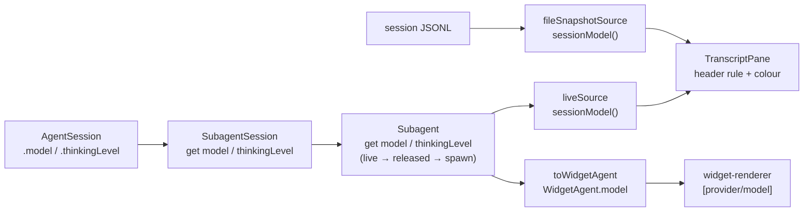

# Editor-style chrome for the session viewer, and the model in the widget

## Release Recommendation

**Release:** ship independently

Issue #876 was filed outside any roadmap phase (`docs/architecture/history/phase-22-front-door-delivery.md` records it as out of scope for the roadmap), and pi-subagents has no open improvement phase, so no `Release:` tag applies.
The plan folds in [#954], which is likewise unphased; both close together.

## Problem Statement

The `/subagents:sessions` transcript pane paints a bold `Subagent session` line, the viewport, and a dim footer line.
Docked above the editor with the conversation streaming above it, the pane has no edges, so it reads as loose text rather than as a distinct surface.
Its header also names nothing: the operator cannot tell from the pane which agent, model, or thinking level produced the transcript they are reading.

Pi's own editor solved the edge problem with rules that carry labels (`── ⠋ Working ─────`), coloured by the session's thinking level.
The pane should adopt that vocabulary: a top rule naming the agent, its model, and its thinking level, and a bottom rule carrying the scroll position and key hints, both coloured the way Pi colours the editor border.

[#954] (filed by `the-matt-moo`) asks for the same model fact on the other UI surface: the agents widget shows `Agent (twin)` and its stats but never which provider and model is running each concurrent agent, which matters most when a model is picked dynamically or fails over mid-run.
Both surfaces need the same fact from the same place, which neither the child session nor `Subagent` surfaces today.

## Goals

- Replace the pane's header and footer lines with labeled rules, at the same two rows of chrome.
- Header rule: `── <name> (twin)  <description> · <provider>/<model> • <thinking> ───…`, left-anchored after a `──` lead-in.
- Footer rule: `── <N> lines · <P>% ───…─── ↑↓ scroll · PgUp/PgDn · Esc close ──`.
- Colour both rules with Pi's `theme.getThinkingBorderColor(level)` for the child's thinking level, read at every render, the same mapping Pi's editor border uses.
- Narrow widths: the footer drops the key hints before it truncates the position; the header drops the description, then the model, before it truncates the name.
- Surface the child's live model and thinking level through the objects that own them (`AgentSession` → `SubagentSession` → `Subagent`), with no reach-through, and retain them past `releaseSession()` the way `outputFile` already is.
- Show `[provider/model]` on every running and finished agent line in the agents widget ([#954]), always, not only when it differs from the parent's model.
- One model vocabulary on both surfaces: `anthropic/claude-sonnet-5`, the syntax the Agent tool's `model` argument already accepts.

The change is **not breaking**: nothing here is config, a default, or a public output shape.
`SubagentRecord` (the public service snapshot) is untouched, and `TranscriptSource`/`NavigableSubagent`/`WidgetAgent` are package-internal.

## Non-Goals

- A frame.
  Corners and side borders stay out, as ADR 0007 (`docs/decisions/0007-transcript-viewer-is-not-an-overlay.md`) decided; the rules replace the two lines the pane already spends, at zero row cost.
- Adding `model`/`thinkingLevel` to the public `SubagentRecord`.
  That is an ADR 0005 admission question with a semver consequence, and neither surface here needs it.
- Thinking level in the widget.
  [#954] asks for the model only; the widget lines are already the widest the package renders.
- Re-styling the widget's `● Agents` heading or `├─` tree rows; #876 scopes them out.
- Moving box-drawing characters into `src/ui/glyphs.ts`.
  That module's doc comment excludes them as layout, not vocabulary.
- Consuming Pi's `renderTopBorder` override or `StatusIndicator.renderInBorder`.
  Those are 0.85-only internal seams; the look is reimplemented with `visibleWidth`/`truncateToWidth`, so the peer floor stays `>=0.81.0`.

## Background

- `src/ui/session-navigator.ts` — `TranscriptPane.render(width)` pushes `fit(th.bold("Subagent session"))`, the viewport, and a footer whose gap already fills the row to exactly `width`.
  `CHROME_LINES = 2` feeds `viewportHeight`; `scrollBounds` is the single width → viewport mapping `render` and `handleInput` share.
  `SessionNavigatorHandler.handle` picks a `NavigationEntry`, builds a `TranscriptSource`, and mounts the pane with `{ overlay: false }`.
- `src/ui/session-navigation.ts` — `NavigableSubagent` (the fields the navigator reads off a `Subagent`), `NavigationEntry` (`live` carries the record, `snapshot` only the `outputFile`), `TranscriptSource`, `liveSource`, `fileSnapshotSource` (which already calls Pi's `buildSessionContext` and keeps only `messages`), and `buildLabel`.
- `src/lifecycle/subagent-session.ts` — `SubagentSession` wraps `_session: AgentSession` and exposes a public `session` getter.
  [#954]'s proposed `this.subagentSession?.session?.model` reaches through it; this plan adds delegating getters instead.
- `src/lifecycle/subagent.ts` — `Subagent` holds `subagentSession?`, `execution.model`/`execution.thinkingLevel` (spawn-time overrides, `undefined` when the child inherits), and `releaseSession()`, which already captures `_releasedOutputFile` before disposing the session.
- `src/ui/agent-widget.ts` — `toWidgetAgent(record: Subagent)` projects a `WidgetAgent`; `src/ui/widget-renderer.ts` defines `WidgetAgent` and renders `renderRunningLines`/`renderFinishedLine`.
- `src/ui/display.ts` — the narrow `Theme = { fg, bold }` shared by eight render sites and six test theme stubs.

Facts verified at planning time:

- Pi's editor **left-anchors** its embedded working status (`"── " + status + " " + fill`, `custom-editor.ts` `renderTopBorder`); only the `↑ N more` overflow label is centred.
  The issue's "pi centers the working status" is not what the code does.
- `Theme.getThinkingBorderColor(level)` exists at the peer floor (`v0.81.0` `theme.ts`) and in the pinned 0.84.4 (`dist/modes/interactive/theme/theme.js`); an unknown level falls to `thinkingOff`, and a theme without `thinkingMax` falls back to `thinkingXhigh`.
- `AgentSession.model` and `AgentSession.thinkingLevel` getters exist at `v0.81.0`.
- `buildSessionContext` returns `{ messages, thinkingLevel: string, model: { provider, modelId } | null }` (0.84.4 `session-manager.d.ts`).
  Measured on a real child session file (the Tidy-First assessor's own, 110 lines) through the same `parseSessionEntries` → `buildSessionContext` path `fileSnapshotSource` uses: `{"model":{"provider":"anthropic","modelId":"claude-sonnet-5"},"thinkingLevel":"medium","messages":107}`.
- pi-tui's renderer rejects a line only when `visibleWidth(line) > width` (`tui-main-screen.js`), and Pi's editor and `DynamicBorder` paint rules of exactly `width` every frame.
  The pane's current footer also already fills to exactly `width`.
  The comment in `render` claiming "a row padded to the full terminal width wraps onto the next terminal row" (from `243bdb21`) is contradicted by both, and is corrected in this change.
- Measured label widths (pi-tui `visibleWidth`): `142 lines · 87%` is 15 columns, `↑↓ scroll · PgUp/PgDn · Esc close` is 33.
  The footer fits both halves at `3 + 15 + 1 + 1 + 1 + 33 + 3 = 57` columns and above (arithmetic on measured widths).

AGENTS.md constraints that apply: pnpm only; `#src/` imports; a `package-pi-subagents` rule that box-drawing stays at the render site.

## Design Overview

### Data flow



Each hop asks only its direct collaborator.

### Lifecycle layer

```typescript
// SubagentSession
get model(): Model<any> | undefined { return this._session.model; }
get thinkingLevel(): ThinkingLevel { return this._session.thinkingLevel; }

// Subagent
get model(): Model<any> | undefined {
  return this.subagentSession?.model ?? this._releasedModel ?? this.execution.model;
}
get thinkingLevel(): ThinkingLevel | undefined {
  return this.subagentSession?.thinkingLevel ?? this._releasedThinkingLevel ?? this.execution.thinkingLevel;
}
```

`_releasedModel` / `_releasedThinkingLevel` lifecycle, in one place: **set** in `releaseSession()` beside `_releasedOutputFile`, read from the session being released before it is cleared; **never cleared** (a released record never regains a session in this path; `resume` builds a new `subagentSession`, which the getter reads first); **read** only by the two getters above.
The live read comes first, so a model the child switches to mid-run (failover) is what both surfaces show.
Before the session exists (queued) the spawn override answers, and an inherited model is `undefined` until the session is created.

### Navigation layer

```typescript
/** What a model-and-thinking display reads. `Model<any>` satisfies it structurally. */
export interface ModelIdentity { readonly provider: string; readonly id: string }   // display.ts

export interface SessionModel {                                                        // session-navigation.ts
  readonly model: ModelIdentity | undefined;
  readonly thinkingLevel: string | undefined;
}

export interface TranscriptSource {
  // …existing four methods
  /** Model and thinking level, read at call time — a live child can switch either mid-run. */
  sessionModel(): SessionModel;
}

/** Static identity for the pane's header, built once alongside the picker label. */
export interface EntryHeading {
  readonly name: string;
  readonly modeLabel: string | undefined;
  readonly description: string;
}
// NavigationEntry: both variants gain `readonly heading: EntryHeading`.
// NavigableSubagent gains `readonly model: ModelIdentity | undefined; readonly thinkingLevel: string | undefined`.
```

- `liveSource(record).sessionModel()` returns `{ model: record.model, thinkingLevel: record.thinkingLevel }` on every call.
- `fileSnapshotSource` keeps what `buildSessionContext` already returns, mapping `{ provider, modelId }` to `{ provider, id }` and `null` to `undefined`.
- `listNavigableAgents` builds `heading` with `getDisplayName`/`getPromptModeLabel` and the record's `description`, for both entry kinds; `buildLabel` keeps producing the picker label from the same fields.

### The rule builder (`src/ui/labeled-rule.ts`, new)

```typescript
/**
 * A full-width horizontal rule with labels embedded, in Pi's editor-border style:
 * `── <left> ─────── <right> ──`. Labels arrive pre-styled; `paint` colours only
 * the rule's own characters. Each label list is a preference order of fallbacks.
 */
export function labeledRule(
  width: number,
  paint: (rule: string) => string,
  left: readonly string[],
  right: readonly string[] = [],
): string;
```

Selection: for each `left` candidate in order, try each `right` candidate and then no right label; the first combination that fits wins.
So the right label is dropped before the left one falls back.
A combination fits when `3 + w(left) + 1 + 1 + (right ? 1 + w(right) + 3 : 0) <= width` (at least one `─` of fill).
When nothing fits, the last `left` candidate is truncated with `…` via `truncateToWidth` to leave the lead-in, one space, and one `─`.
The output's `visibleWidth` is exactly `width` in every branch; the pane never calls it below `width` 6.
It depends only on `@earendil-works/pi-tui`, so it adds no import edge inside `ui/`.

### The pane

```typescript
/** The pane's theme: the shared narrow Theme plus the one method only the pane needs. */
type TranscriptTheme = Theme & { getThinkingBorderColor(level: string): (text: string) => string };
```

The widening stays local to `session-navigator.ts` (`TranscriptPaneOptions.theme`, the pane's field, and `CustomComponentFactory`'s `theme` parameter), so the six unrelated `Theme` stubs in the suite do not change.
Pi's `Theme` satisfies it (method-parameter bivariance covers `ThinkingLevel` vs `string`).

```typescript
// render(width), sketch
const { model, thinkingLevel } = this.source.sessionModel();
const paint = this.theme.getThinkingBorderColor(thinkingLevel ?? "off");
lines.push(labeledRule(width, paint, this.headerLabels(model, thinkingLevel)));
// …viewport unchanged…
lines.push(labeledRule(width, paint, [position], [hints]));
```

`headerLabels` returns, most to least informative: `name+mode  description · runtime`, `name+mode · runtime`, `name+mode`.
`runtime` is `formatModel(model)` plus `• <level>` (Pi's footer wording: `• thinking off` when the level is `off`); either part is omitted when unknown, and the separator with it.
Styles: name `bold`, mode tag / description / runtime `muted`, position and hints `dim` (as today).
The pane keeps its `source` (today only the constructor sees it) so `render` can ask it.

### The widget ([#954])

`WidgetAgent` gains `model?: ModelIdentity`; `toWidgetAgent` copies `record.model`.
`renderRunningLines` and `renderFinishedLine` insert `theme.fg("dim", "[" + formatModel(model) + "]")` after the name and mode tag, when a model is known.
`formatModel(model: ModelIdentity): string` → `${provider}/${id}`, in `display.ts`, used by both surfaces.

```text
├─ ⠹ Agent [anthropic/claude-sonnet-5]  Refactor auth module · ↻5≤30 · 5 tool uses · 33.8k token (62%) · 12.3s
```

### Edge cases

- Snapshot of a session with no `model_change` entry: `model` is `undefined`; the header shows the name, description, and `• thinking off` (`buildSessionContext` defaults the level to `off`).
- Thinking `off` colours the rule `thinkingOff`, which some themes make faint (catppuccin-macchiato: surface0 `#363a4f`); the editor looks the same at `off`, so the pane matches it.
- A live child whose thinking level or model changes: the next render re-reads `sessionModel()`, and live sources already request a render on every session event.

## Module-Level Changes

| File                                                                         | Change                                                                                                                                                                                                                                    |
| ---------------------------------------------------------------------------- | ----------------------------------------------------------------------------------------------------------------------------------------------------------------------------------------------------------------------------------------- |
| `src/lifecycle/subagent-session.ts`                                          | Add `get model()` and `get thinkingLevel()` delegating to `_session`.                                                                                                                                                                     |
| `src/lifecycle/subagent.ts`                                                  | Add `get model()`, `get thinkingLevel()`, `_releasedModel`, `_releasedThinkingLevel`; capture both in `releaseSession()`.                                                                                                                 |
| `src/ui/display.ts`                                                          | Add `ModelIdentity` and `formatModel`. The shared `Theme` is **unchanged**.                                                                                                                                                               |
| `src/ui/labeled-rule.ts`                                                     | New: `labeledRule`.                                                                                                                                                                                                                       |
| `src/ui/session-navigation.ts`                                               | `NavigableSubagent` gains `model`/`thinkingLevel`; `SessionModel`, `EntryHeading`; `TranscriptSource.sessionModel()`; `liveSource`/`fileSnapshotSource` implement it; `NavigationEntry` gains `heading`; `listNavigableAgents` builds it. |
| `src/ui/session-navigator.ts`                                                | `TranscriptTheme`; `TranscriptPaneOptions` gains `heading`; `render` paints two `labeledRule` rows; handler passes `entry.heading`; module doc comment and the stale padding comment updated.                                             |
| `src/ui/widget-renderer.ts`                                                  | `WidgetAgent.model?`; model tag in `renderRunningLines`/`renderFinishedLine`.                                                                                                                                                             |
| `src/ui/agent-widget.ts`                                                     | `toWidgetAgent` copies `record.model`.                                                                                                                                                                                                    |
| `test/helpers/mock-session.ts`                                               | `MockSession`/`createMockSession` gain `model`/`thinkingLevel`; `createSubagentSessionStub` gains delegating getters.                                                                                                                     |
| `test/helpers/make-navigable.ts`                                             | Defaults for `model`/`thinkingLevel`.                                                                                                                                                                                                     |
| `test/helpers/transcript-fixtures.ts`                                        | `fakeSource` default `sessionModel`.                                                                                                                                                                                                      |
| `test/lifecycle/subagent-session.test.ts`, `test/lifecycle/subagent.test.ts` | New getter tests.                                                                                                                                                                                                                         |
| `test/ui/labeled-rule.test.ts`                                               | New.                                                                                                                                                                                                                                      |
| `test/ui/session-navigation.test.ts`                                         | `sessionModel` and `heading` tests.                                                                                                                                                                                                       |
| `test/ui/session-navigator.test.ts`                                          | `ansiTheme` gains `getThinkingBorderColor`; chrome tests rewritten/added; handler heading test.                                                                                                                                           |
| `test/widget-renderer.test.ts`, `test/ui/agent-widget.test.ts`               | Model-tag and projection tests.                                                                                                                                                                                                           |
| `README.md`                                                                  | Widget sample gains the `[provider/model]` tag; `/subagents:sessions` section describes the header and footer rules.                                                                                                                      |
| `docs/architecture/architecture.md`                                          | Module tree gains `labeled-rule.ts`.                                                                                                                                                                                                      |
| `.pi/skills/package-pi-subagents/SKILL.md`                                   | Domain table: UI 9 → 10 modules, 69 → 70 files, UI responsibility names the labeled rule.                                                                                                                                                 |

Predicted unchanged, and the claim each rests on:

- `docs/decisions/0007-transcript-viewer-is-not-an-overlay.md` — its Consequences say the chrome "is a header and a footer line" and argue against a frame; both remain true.
- `src/ui/glyphs.ts` — `─` is layout, not vocabulary (its doc comment).
- `src/ui/transcript-content.ts` — consumes `TranscriptSource` but calls only the existing four methods; adding a method breaks no call.
- `src/service/service.ts` (`SubagentRecord`) — nothing here reads or writes it.
- `docs/architecture/architecture.md` health-metrics row (`11,048 (69 files)`) — a computed number refreshed by `/finish-phase`'s recompute, not hand-edited here.
- The six `Theme` stubs (`test/widget-renderer.test.ts`, `test/ui/agent-widget.test.ts`, `test/tools/get-result-renderer.test.ts`, `test/tools/result-renderer.test.ts`, `test/tools/get-result-tool.test.ts`, `test/observation/renderer.test.ts`) — the shared `Theme` does not grow.

## Test Impact Analysis

1. New tests enabled: `labeledRule` is pure, so its fit/fallback/truncation branches and its exact-width invariant are testable across a width sweep without mounting Pi's components.
   `SubagentSession`/`Subagent` model getters become assertable directly.
2. Redundant tests: none removed.
   The pane's footer layout arithmetic moves into `labeledRule`, so the pane tests assert what the rules *say* and leave the geometry to `labeled-rule.test.ts`.
3. Kept as-is, because they pin the pane's own layer: the `height` (`14`/`28`/`5` rows), `scroll bounds`, `spends only two rows on chrome` (25 numbered rows at 40×80), and `mounts the transcript outside Pi's overlay compositor` tests.
   All must stay green unmodified; that they do is the evidence chrome still costs two rows.
   `paints no box-drawing glyphs` is **rewritten**, not deleted: its claim was "no frame", which becomes "no `╭╮╰╯│` anywhere, and `─` only in the first and last rows".

## Invariants at risk

| Invariant                                         | Constituency                          | Pinned by                                                                                                                   |
| ------------------------------------------------- | ------------------------------------- | --------------------------------------------------------------------------------------------------------------------------- |
| The pane mounts non-overlay (ADR 0007, [#733])    | Operators' scrollback                 | `SessionNavigatorHandler > mounts the transcript outside Pi's overlay compositor` (unchanged)                               |
| No frame: no corners or side borders              | Operators reading on narrow terminals | Rewritten `chrome > paints no frame`                                                                                        |
| Chrome costs exactly two rows                     | Transcript viewport height            | `height` tests and `spends only two rows on chrome` (unchanged values)                                                      |
| No row exceeds `width` (pi-tui throws otherwise)  | Every render                          | New `labeled-rule` width sweep; new pane test asserting `visibleWidth(line) <= width` for every row at widths 6, 20, 57, 80 |
| `render` and `handleInput` agree on scroll bounds | Scrolling                             | `scroll bounds` tests (unchanged)                                                                                           |

## TDD Order

1. **`test(pi-subagents): expose model and thinking level on the shared session mocks`** Prepares steps 2–3: `createMockSession` (wrapped by the real `SubagentSession` in `subagent.test.ts`'s `realSessionFactory`) and `createSubagentSessionStub` (used as `agent.subagentSession`; `grep -rln "createSubagentSessionStub\|toSubagentSession" test` lists 12 files, 9 suites plus 3 helpers) carry neither field, so every getter test would otherwise improvise its own override.
   Add `model: undefined` and `thinkingLevel: "off"` to `MockSession`/`createMockSession`, and `get model()`/`get thinkingLevel()` delegating to the wrapped session on the stub.
   Fixture only; the full suite stays green, and there is no mutation to name.
2. **`refactor(pi-subagents): read the child's model and thinking level off SubagentSession`** `subagent-session.test.ts`, under a new `describe("model and thinking level")`: both getters return the wrapped session's current values, and follow a change to them.
   Killing mutation: make `get model()` return `undefined` unconditionally; and, separately, make `get thinkingLevel()` return `"off"` — each kills its own test.
   `refactor:` because nothing reads them yet.
3. **`refactor(pi-subagents): answer a subagent's model from its live session, then its release, then its spawn`** `subagent.test.ts`, `describe("model and thinking level")` with one nested block per source: live session (and a mid-run change to the session's model is reflected), after `releaseSession()` (values retained), before a session exists (spawn `execution` values; `undefined` when inherited).
   Killing mutations: (a) make `get model()` return `this.execution.model` only → kills the live and the mid-run tests; (b) delete the `_releasedModel` assignment in `releaseSession()` → kills the after-release test; (c) the same two for `thinkingLevel`.
   Commit trailer (final paragraph): `Co-authored-by: Matt Moo(re) <62058597+the-matt-moo@users.noreply.github.com>` — the `Subagent.model` getter is [#954]'s mechanism.
4. **`refactor(pi-subagents): add a labeled rule builder in Pi's editor-border style`** New `test/ui/labeled-rule.test.ts`, grouped by `fit`, `fallback`, `truncation`, `painting`, `width`.
   Exact-string cases at 80 columns (left only; left and right), right dropped before left falls back (footer at 40), left fallback order (three candidates at widths that admit each), truncation with `…` when no candidate fits, `paint` applied to rule characters only (paint = `(s) => "<" + s + ">"`, labels appear unbracketed), and `visibleWidth(out) === width` for every width 6–120 over each branch.
   Killing mutations: (a) swap the loop nesting so left falls back before right is dropped → kills the footer-at-40 test; (b) change the fit check's fill term from `+ 1` to `+ 0` → kills the width sweep at the boundary width; (c) wrap the whole output in `paint` → kills the painting test; (d) return the untruncated last candidate when none fits → kills truncation and the width sweep.
   `refactor:` because no consumer uses it yet.
5. **`refactor(pi-subagents): give transcript sources the session's model and each entry a heading`** `session-navigation.test.ts`: `liveSource(record).sessionModel()` reads the record at call time (mutate `record.model` between two calls); `fileSnapshotSource` over a JSONL fixture carrying `model_change` and `thinking_level_change` returns `{ model: { provider, id }, thinkingLevel }`; a file with no `model_change` yields `model: undefined`; `listNavigableAgents` gives live and snapshot entries a `heading` with name, mode label, and description.
   Updates `makeNavigable` and `fakeSource` defaults in the same commit (both interfaces gain required members).
   Killing mutations: (a) have `liveSource` capture `sessionModel` once at construction → kills the call-time test; (b) make `fileSnapshotSource` return `model: undefined` → kills the file test; (c) build the snapshot entry's heading with `description: ""` → kills the snapshot heading test.
   `refactor:` because the pane does not read either yet.
6. **`feat(pi-subagents): show the subagent's name, model, and thinking level in the session viewer's rules`** Adds `TranscriptTheme`, `formatModel`/`ModelIdentity` in `display.ts`, `TranscriptPaneOptions.heading`, the two `labeledRule` rows, and the handler's `entry.heading` pass-through; updates the stale padding comment and the module doc comment.
   `session-navigator.test.ts`: `ansiTheme()` gains `getThinkingBorderColor: vi.fn((level) => (s) => \`{${level}}${s}\`)`.
   New `describe("header rule")`: carries name, mode tag, description, `anthropic/claude-sonnet-5`, `• high`; `• thinking off` wording; drops the description, then the model, as width shrinks.
   New `describe("rule colour")`: both rules are painted for the source's thinking level; after `sessionModel()` changes the next render repaints with the new level; an unknown level paints `off`.
   New `describe("footer rule")`: position and hints at 80; hints dropped, position kept, at 40.
   Rewrite `paints no box-drawing glyphs` → `paints no frame`; add the `visibleWidth(line) <= width` sweep; handler test: the mounted pane's header names the picked entry's agent.
   Killing mutations: (a) pass `"off"` to `getThinkingBorderColor` unconditionally → kills the colour tests; (b) drop `runtime` from `headerLabels` → kills the model and thinking tests; (c) pass a fixed heading in the handler instead of `entry.heading` → kills the handler test; (d) delete the footer's `[hints]` argument → kills the footer-at-80 test.
   Existing height and scroll tests stay unmodified and green.
7. **`feat(pi-subagents): show each background subagent's provider and model in the agents widget`** `widget-renderer.test.ts`: the running header and the finished line carry `[anthropic/claude-sonnet-5]` after the name and mode tag; no `[` segment when `model` is absent.
   `agent-widget.test.ts`, in the existing projection block: `toWidgetAgent` copies `record.model`.
   Killing mutations: (a) omit the tag in `renderFinishedLine` only → kills the finished-line test, running test stays green; (b) the same for `renderRunningLines`; (c) drop `model` from `toWidgetAgent` → kills the projection test.
   Commit body `Closes #954`; trailer (final paragraph): `Co-authored-by: Matt Moo(re) <62058597+the-matt-moo@users.noreply.github.com>`.
8. **`docs(pi-subagents): document the session viewer's rules and the widget's model tag`** README widget sample and `/subagents:sessions` section; architecture module tree; package skill domain table.
   Verify: `grep -n "labeled-rule" packages/pi-subagents/docs/architecture/architecture.md .pi/skills/package-pi-subagents/SKILL.md` returns a line in each.

## Risks and Mitigations

- **A full-width rule wraps on some terminal.**
  The claim that motivated the stale comment is contradicted by Pi's own editor and `DynamicBorder` (exactly `width` every frame) and by the pane's current footer (already exactly `width`).
  Mitigation: `/tdd-plan` opens the pane in a real session after step 6 at two widths and confirms no wrapped rows before committing.
- **Theme without `getThinkingBorderColor`.**
  Present at the peer floor `0.81.0`; the pane's narrow type makes a missing method a compile error in tests rather than a runtime surprise.
- **Faint rule at `thinking off`.**
  Matches Pi's editor at the same level; accepted rather than special-cased.
- **Mock drift.**
  Step 1 centralizes the new fields in the shared mocks, so step 2–3 tests override one fixture rather than each suite improvising.
- **`Subagent.model` before the session exists is `undefined` for an inherited model.**
  Queued agents render only as a collapsed count in the widget, and the pane lists only session-ready or released agents, so no surface shows the gap.

## Open Questions

- Should the widget's tree connectors also take the thinking-level colour, so the two surfaces match?
  Deferred until an operator asks; it is a widget restyle #876 scoped out.

[#733]: https://github.com/gotgenes/pi-packages/issues/733
[#954]: https://github.com/gotgenes/pi-packages/issues/954
